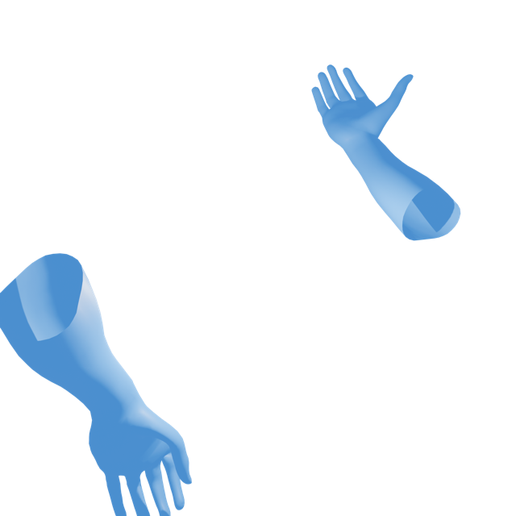
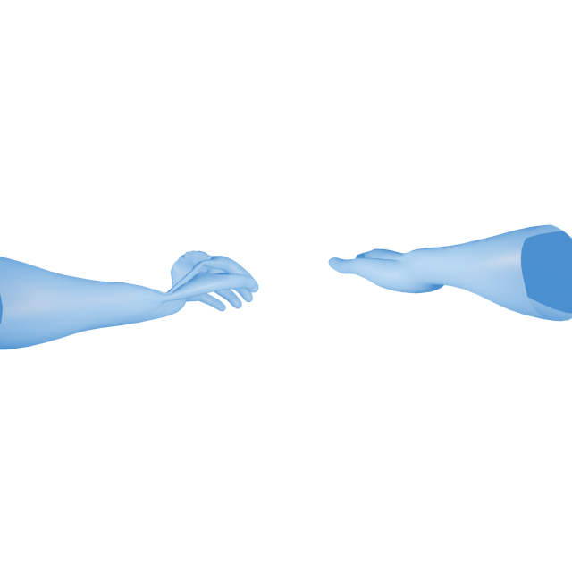
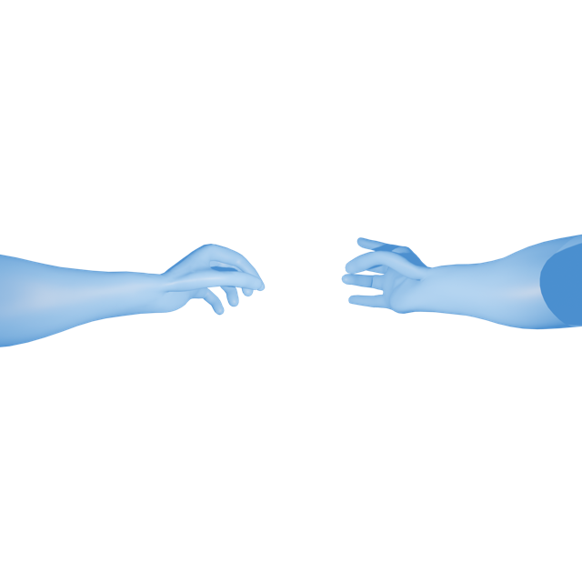

# GestureKit

A Swift Package to detect Hand Gestures.

## Table of contents

1. [Introduction](#introduction)
2. [How it works](#how_it_works)
3. [Benefits](#benefits)
4. [Example Code](#example_code)
	1. [Gesture Detection Example Code](#example_detection_code)
	2. [Virtual Hands Example Code](#example_virtual_hands_code)
5. [Examples](#examples)
6. [Appendix](#appendix)
7. [About me](#about_me)


## Introduction <a name="introduction"></a>

Gestures can be composed and exported from the VisionOS Gesture Composer App

## How it works <a name="how_it_works"></a>

The GestureComposer App exports `*.gesturecomposer` packages, we can pass these to
the `GestureDetector` which will `detect` if the user has performed a particular gesture.

## Benefits of using GestureKit <a name="benefits"></a>

- You don't need to manually program gestures
- It's faster to create and test gestures
- Gestures can be easily shared between Apps
- Hand gestures can have multiple steps
- Multiple gestures can be detected at a time, for instance, one's left hand could perform a gesture different to one's right hand
- GestureComposer packages contain *.USDZ Animated 3D files of the composed gesture to optionally show users what to do with their hands
- The file-format is straight forward, ready for expansion ✨

## Example Code <a name="example_code"></a>

### Gesture Detection Example Code <a name="example_detection_code"></a>

This example code will create a RealityKit View and run a task to detect the gesture packages set in the configuration.

**Note**: This must be ran in an `Immersive` Space on VisionOS.

```swift
import GestureKit
import RealityKit
import SwiftUI

struct ContentView {

  let configuration = GestureDetectorConfiguration(packages: [
    URL(fileURLWithPath: "/path/to/some/package.gesturecomposer"),
    URL(fileURLWithPath: "/path/to/some/other.gesturecomposer")
  ])
  
  let detector: GestureDetector
  
  init() {
    detector = GestureDetector(configuration: configuration)
  }

}

extension ContentView: View {

  var body: some View {
    realityView
  }

  private var realityView: some View {
    RealityView { _ in

    }
    .task {
      for await qesture in detector.detectedGestures {
        print("Gesture Detected: \(qesture.description)")
      }
    }
  }

}
```

### Virtual Hands Example Code <a name="example_virtual_hands_code"></a>

Part of development required to show virtual hands for debugging, I found this useful so it is bundled as part of GestureKit. 


**Note**: This must be ran in an `Immersive` Space on VisionOS.

```swift
import GestureKit
import RealityKit
import SwiftUI

struct ContentView {

  let virtualHands: VirtualHands
  
  init() {
    let handsConfiguration = VirtualHandsConfiguration(left: HandConfiguration(color: .blue, usdz: HandConfiguration.defaultModel(chirality: .left)), 
    right: HandConfiguration(color: .red, usdz: HandConfiguration.defaultModel(chirality: .right)),
    handRenderOptions: [.model, .joints, .bones])
    virtualHands = VirtualHands(configuration: handsConfiguration)
  }

}

extension ContentView: View {

  var body: some View {
    realityView
  }

  private var realityView: some View {
    RealityView { content in
    
      let root = Entity()
      content.add(root)
    
      do {
        let (left, right) = try virtualHands.createVirtualHands()
        
        rootEntity.addChild(left)
        rootEntity.addChild(right)
      } catch {
        print("Failed to add virtual hands to simulation: \(error.localizedDescription)")
      }

    }
    .task {
      await virtualHands.startSession()
    }
    .task {
      await virtualHands.startHandTracking()
    }
    .task {
      await virtualHands.handleSessionEvents()
    }
  }

}
```

## Examples <a name="examples"></a>

| Gesture | Asset |
|---|---|
| On your Right hand, Move your finger tips together, then move your ring and middle finger to your plam | [Download the Spiderman example](Examples/Spiderman.gesturecomposer)  |
| On your Right hand, Move your finger tips together, then put your middle finger tip and ring finger tip together, then separate them | [Download the Vulcan Salute example](Examples/Vulcan.gesturecomposer)  |
| On your Right hand, Touch your ring finger tip and thumb tip on together | [Download the ring-thumb-tip-touch example](Examples/ring-thumb-tip-touch.gesturecomposer)  |

## Appendix <a name="appendix"></a>

- Download Gesture Composer from the [VisionOS AppStore](https://apps.apple.com/us/app/gesture-composer/id6478170862)
- Browse & Download Gestures from the [Gesture Composer Website](https://www.gesturecomposer.com)
- Follow me on [Twitter/X](https://www.x.com/gesturecomposer)

## About me <a name="about_me"></a>

Hello, I'm Chris, I created Gesture Composer, it has the following components:

- Website
- APIs
- VisionOS App
- Swift Package

It's been fun to make, I hope it's useful to you.